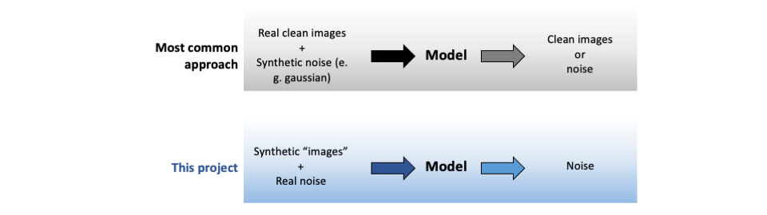

# DeepDenoise
## A deep learning model to remove noise from multidimensional data

In the era of data-driven decision-making, the significance of multidimensional data analysis extends to various sectors and industries. Nevertheless, real data is typically corrupted with noise, which poses challenges in achieving precise interpretations and making informed decisions.

Conventional noise reduction techniques employed in time-series analysis, such as box-car averaging, often introduce distortions into the underlying signal due to temporal and spatial overlap with noise. To address this limitation, in this project I investigate the implementation of a convolutional neural network (CNN) model using a generative approach to obtain large amounts of training data. This strategy allows extensive training without overfitting, leading to good model denoising performance.

I illustrate the approach on fluorescence measurements of brain activity, though it can be more broadly implemented in a variety of signal types. This methodology can therefore play an instrumental role in the extraction of important insights from data, ultimately enabling the development of impactful products in society.

## Training data generation at a glance

In image denoising applications, instances used to train ML models typically consist on real images with negligible noise with added synthetic noise. The model is then trained to recover either the clean target image or the noise residual. There are however many cases where there is no access to clean ground truth data (which can assume the form of images) rendering the above approach unfeasible. To overcome this issue, I apply a training data generation that relies on the direct recording of noise (from the instrumentation used to acquire the data to be denoised) and I rather synthesize the ground truth signal of interest. Notably, this approach requires domain knowledge about the signal of interest and may not be feasible in some applications.

