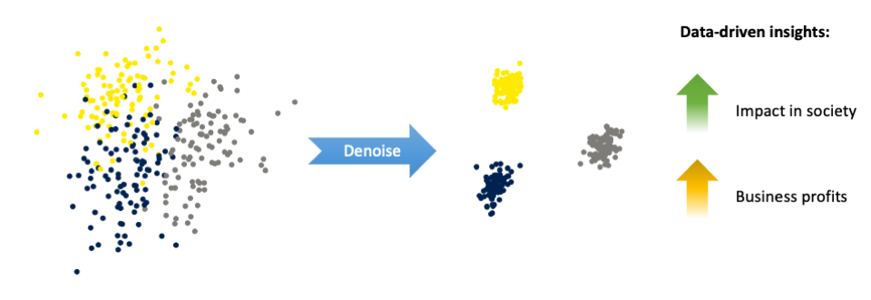
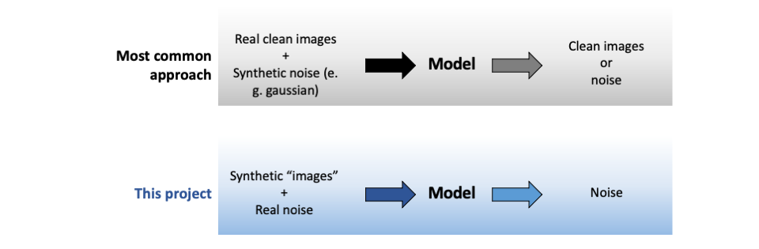

# DeepDenoise
## A deep learning model to remove noise from multidimensional data

In the era of data-driven decision-making, the significance of multidimensional data analysis extends to various sectors and industries. Nevertheless, real data is typically corrupted with noise, which poses challenges in achieving precise interpretations and making informed decisions.

Conventional noise reduction techniques often distort the signal of interest due to overlap with noise across one or more dimensions (e. g. time or space). To address this issues, in this project I investigate the implementation of a convolutional neural network (CNN) model using a generative approach to obtain large amounts of training data. This strategy allows extensive training without overfitting, leading to high denoising performance.

I illustrate the approach on fluorescence measurements of brain activity, though it can be more broadly implemented in a variety of signal types. Ultimately, this methodology can be instrumental in the extraction of important insights from data, enabling the development of impactful products in society.

## Training data generation at a glance

In image denoising applications, instances used to train ML models typically consist on real images with negligible noise with added synthetic noise. The model is then trained to recover either the clean target image or the noise residual. There are however many cases where there is: a) no access to clean ground truth data (which can assume the form of images) or b) the noise is complex and hard to model accurately, rendering the above approach unfeasible. To overcome these limitations, I use a training data generation method relying on the direct recording of noise in the absence of signal and on the synthesis of the ground truth signal. Note that this approach requires domain knowledge about the signal dynamics.

## Main outcomes

The synthetic approach used to generate training instances allowed extensive model training without overfitting on the training set. All details regarding training are presented [here](notebooks/Training_CNNs.ipynb).

The extensive CNN training lead to a high denoising performance. While dramaticaly decreasing the noise level, the trained CNNs preserve sharp high-frequency components of the signal much better than commonly used smoothing approaches. A thorough analysis of CNN denoising performance is presented in the [Test_models](notebooks/Test_models.ipynb) notebook.

For detailed information about the CNN models please check the [model card](model_card.md) 

## How to use the trained models
The multiple model checkpoints saved during training are located in the "models" folder. They can be loaded into python environment and used for training or inference, as exemplified in the [training](notebooks/Training_CNNs.ipynb) notebook.

## Feedback and collaboration
I would greatly appreciate any feedback on the performance of the trained CNNs on other kinds of data. I would also be happy to provide any guidance needed on the usage of the models, and I am willing to suggest possible adjustments for fine-tuning the models to different kinds of data. 
So, don't hesitate to contact me in case of any question related to this project.
